<h2> Hey there! I'm Pham Quoc Hoang (Will). </h2>
<a href="#"><picture>
  <source media="(prefers-color-scheme: dark)" srcset="./coding-dark.gif">
  
</picture></a>

<h3> 👨🏻‍💻 About Me </h3>

Welcome to my GitHub! I love turning ideas into websites that are fast, easy to use and easy to find on Google. Most of my work is building websites for businesses, and in my free time I explore new technologies and use them to build my own products.

👉 &nbsp; Take a look at my projects on my <a href="https://hoangpham.is-a.dev"><b>portfolio</b></a>, and feel free to reach out if you'd like to work together.

<h3>🛠 Tech Stack</h3>

- 🔌 &nbsp; **WordPress:** Custom Themes | Plugin Development | WooCommerce | Elementor | ACF | WP REST API | Hooks & Filters
- 🎨 &nbsp; **Frontend:** HTML5 | CSS3 | JavaScript | TypeScript | React | Next.js | Tailwind CSS | Responsive Design
- ⚙️ &nbsp; **Backend:** PHP | Node.js | Python | Django | REST API | API Integration
- 🗄️ &nbsp; **Database:** MySQL | PostgreSQL | MongoDB | Redis
- 🕷️ &nbsp; **Crawl Data:** Python | Import to WordPress & WooCommerce
- 🚀 &nbsp; **Performance & SEO:** Technical SEO | Rank Math | PageSpeed | Core Web Vitals | LiteSpeed Cache | Security Hardening
- 🔧 &nbsp; **Tools & AI:** Git | Docker | GitHub Actions (CI/CD) | Figma | Claude Code | Codex | Gemini

<h3>🚀 Current Project</h3>

- 💸 &nbsp; <a href="https://hoanhoi.com"><b>Hoàn Hời</b></a> — Creator & Developer (Aug 2026 – Present). A personal project: a cashback platform that lets users create tracked shopping links and get money back once their orders are reconciled. Built with Next.js, PostgreSQL and Redis, with CI/CD on GitHub Actions, and running in production.

<h3> 🤝🏻 Connect with Me </h3>

-  &nbsp; **Portfolio:** <a href="https://hoangpham.is-a.dev">hoangpham.is-a.dev</a>
-  &nbsp; **Resume:** <a href="https://hoangpham.is-a.dev/cv">hoangpham.is-a.dev/cv</a>
-  &nbsp; **Email:** <a href="mailto:hoangpham2263@gmail.com">hoangpham2263@gmail.com</a>
-  &nbsp; **LinkedIn:** <a href="https://www.linkedin.com/in/hoangpham2263/">linkedin.com/in/hoangpham2263</a>

### ⚙️ &nbsp;Stats and Activity

<b>Note:</b> The languages card lists the languages I work with most, not an automatic count of my public repositories. Stats and streak only reflect public activity on this account.

